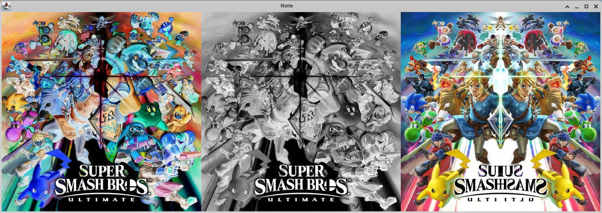
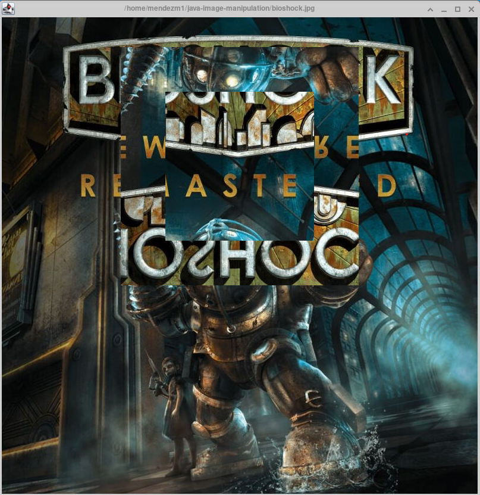
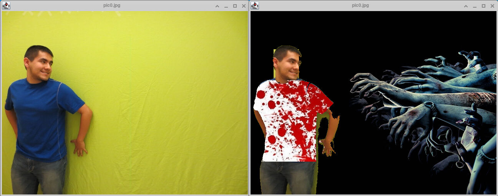
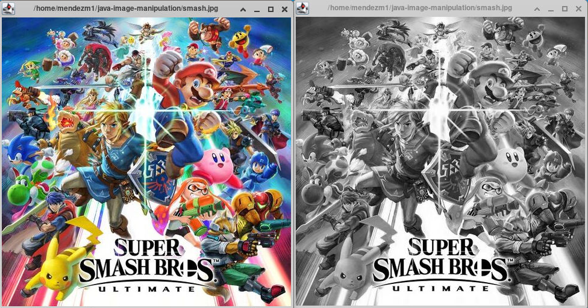
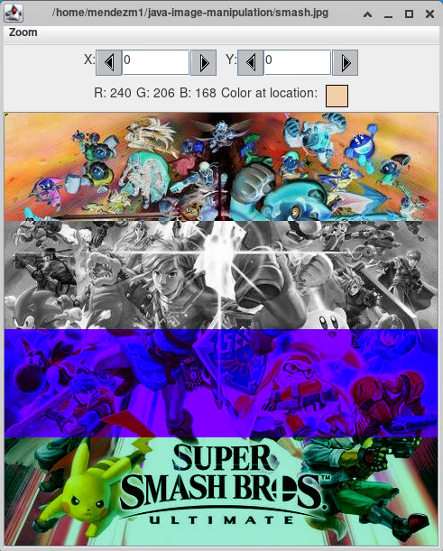
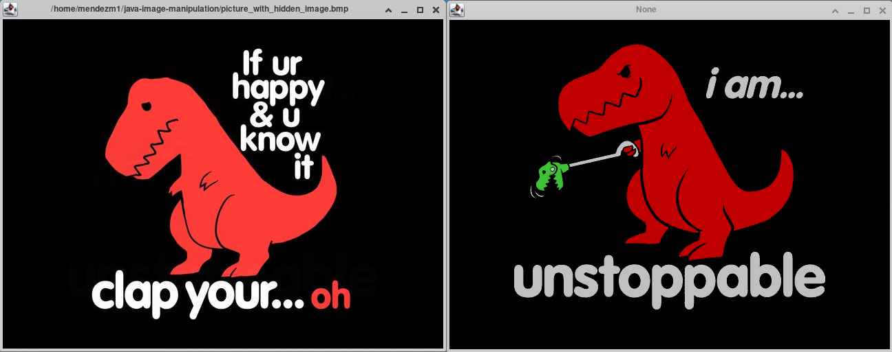

# Java Image Manipulation
This is a compilation of programs to practice and understand image manipulate using Java

## Technologies
The programs in this project were run using the following:
* Java 11
* X11

## Setup
All Java programs are able to run due to the files within the **Environment** folder. This means you will want to ensure that no changes are made to the folder or its contents. Otherwise, you may not be able to run any of the image programs.

After cloning or forking the repository, you can run any of the Java programs through the command line in the below manner:
1. You will want to `cd` into the repository
2. Compile the Java program you want to run while ensuring the classpath is defined as the **Environment** folder
   - An example of this would be `javac -cp Environment/ PixelManipulation.java`
3. Run the *class* file created and enure the classpath is defined as both the **Environment** folder and the current directory
   - An example of this would be `java -cp Environment/:. PixelManipulation`

## Output
### Collage

### Flip Portion

### Green Screen

### Greyscale

### Pixel Manipulation

### Show Hidden Image

